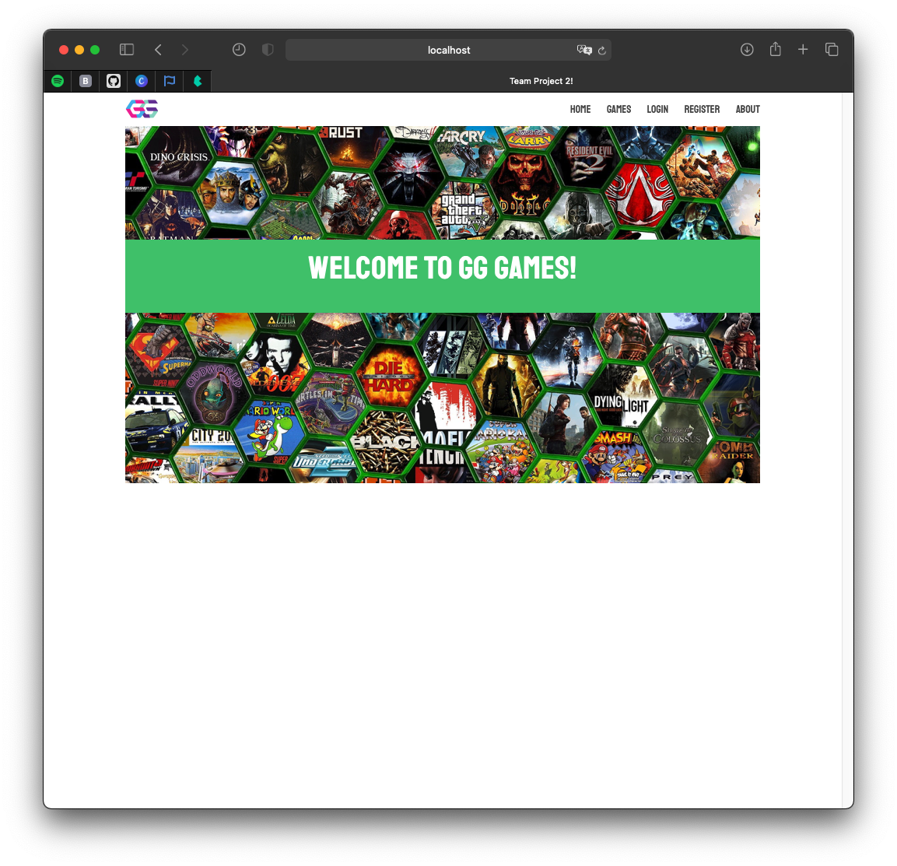
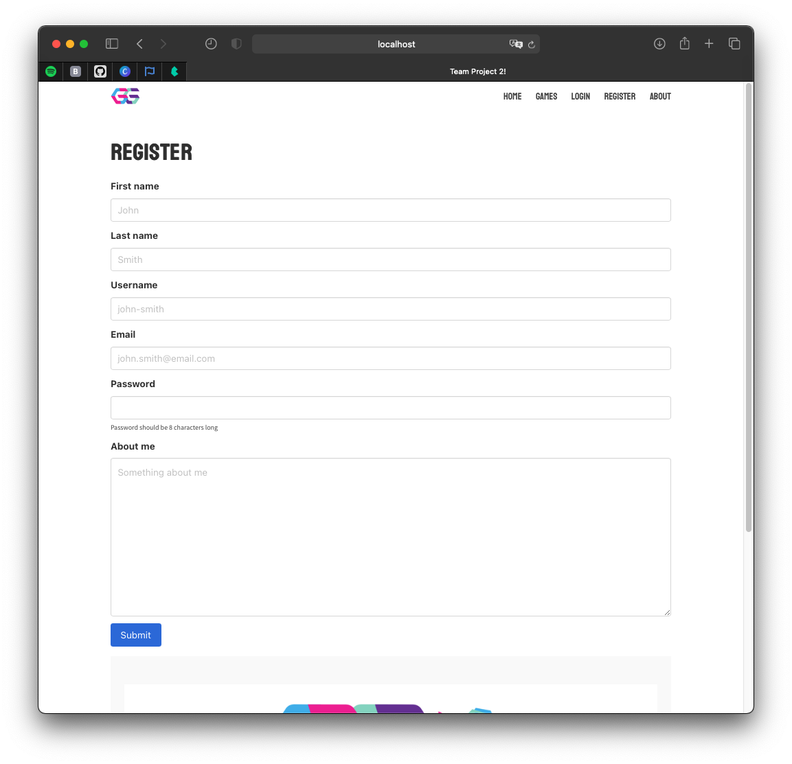
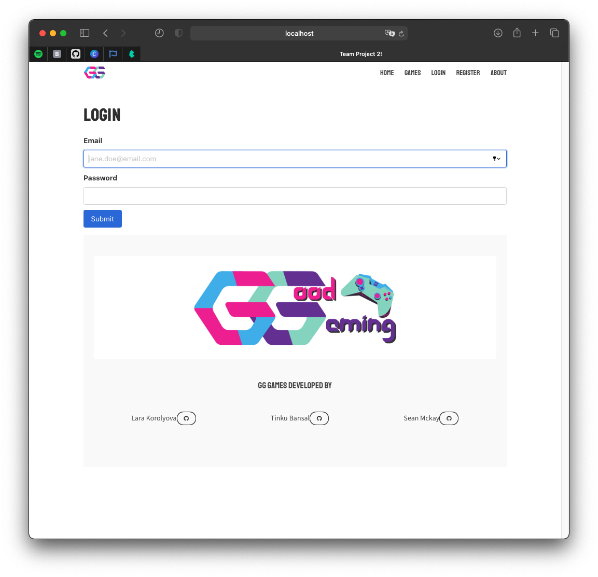
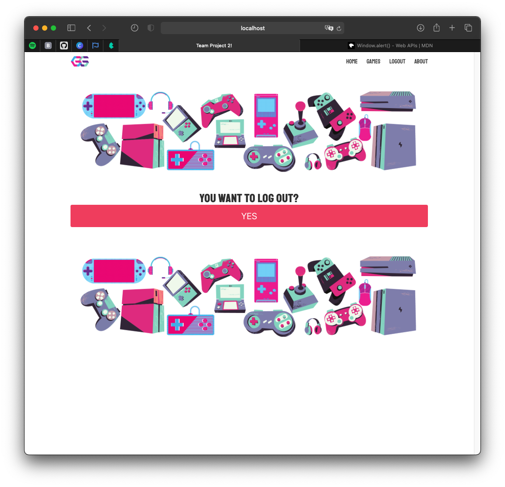
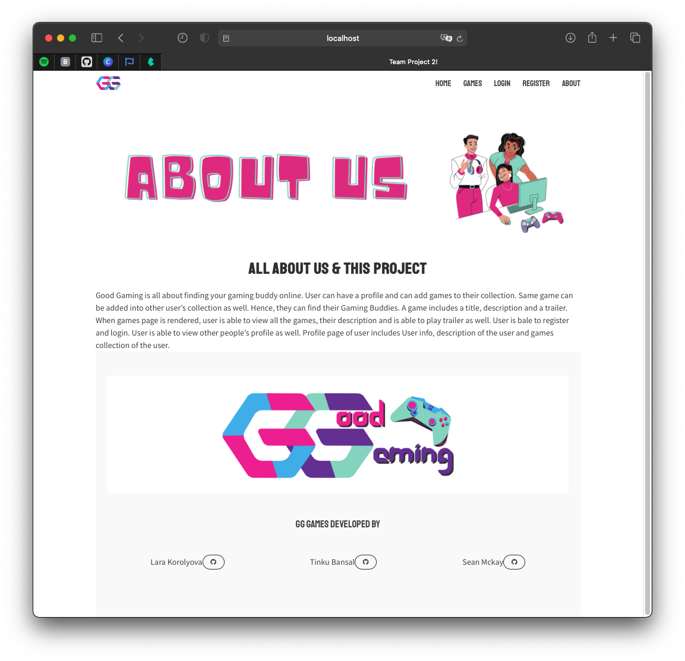
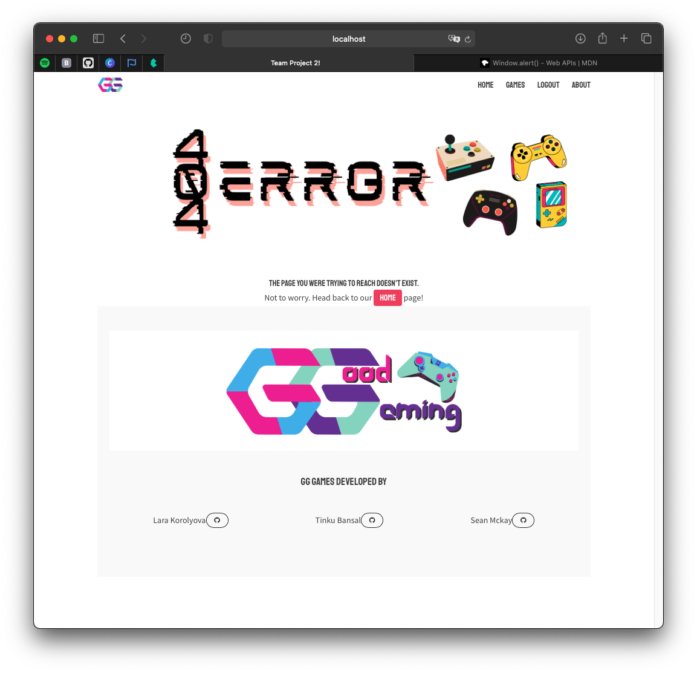
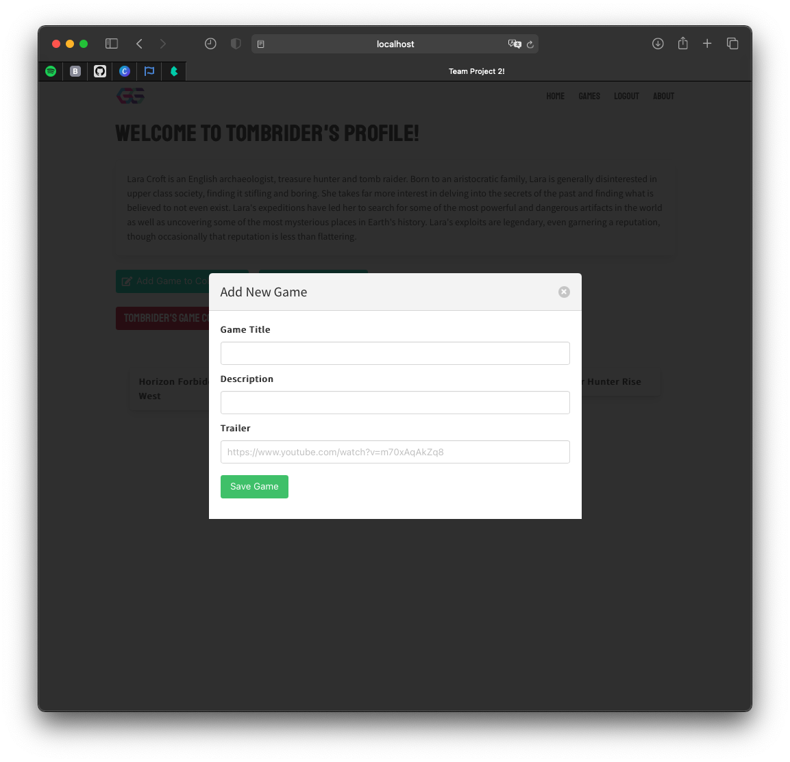
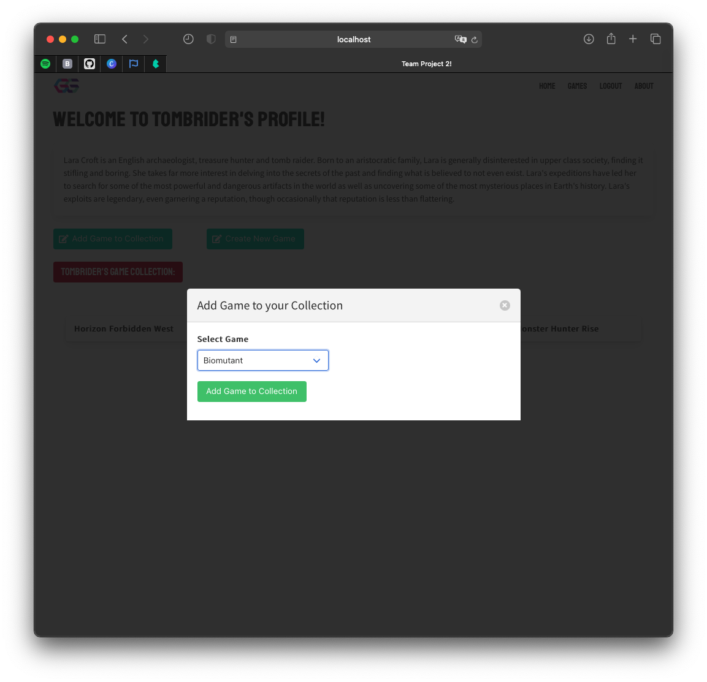
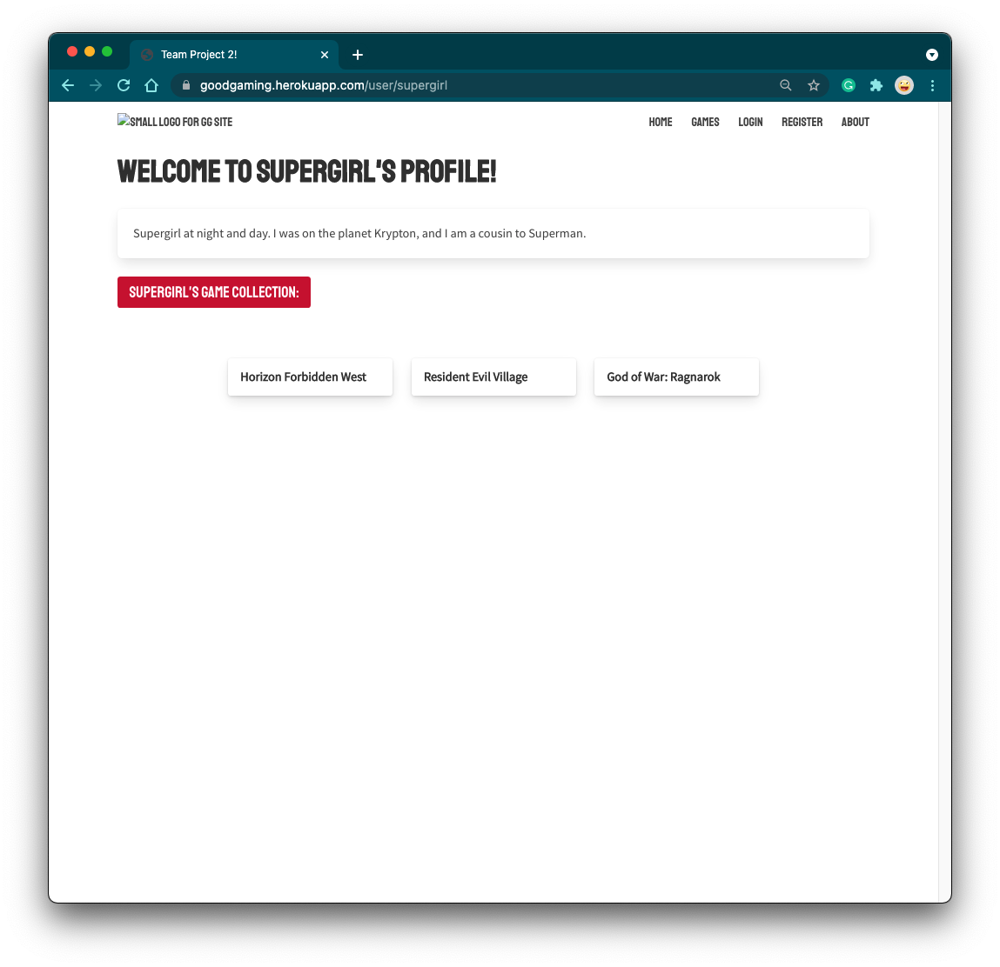
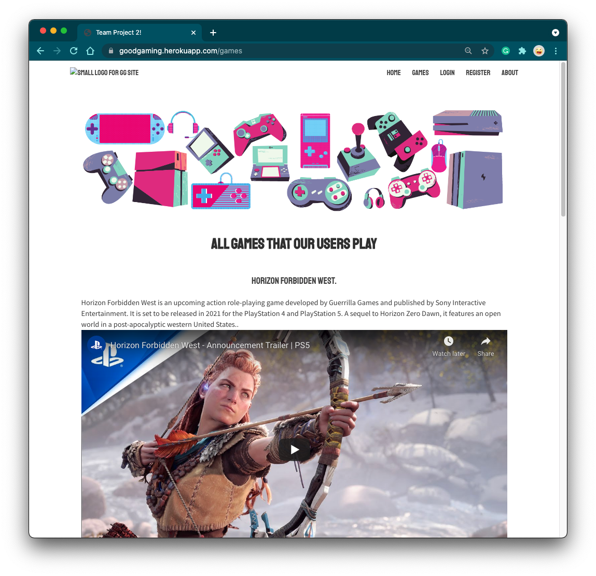

# Project-2 --> GG - Good Gaming

    Coding Bootcamp - Project - 2

  
Table of Contents

  <ol>
      <li>
      <a href="#about-the-project">About The Project</a>
      <ul>
        <li><a href="#live-url">Live URL</a></li>
        <li><a href="#team">Team</a></li>
      </ul>
    </li>
    <li><a href="#description">Description</a></li>
    <li><a href="#features">Features</a></li>
    <li><a href="#technical-part">Technical Part</a>
        <ul>
            <li><a href="#demo">Demo</a></li>
            <li><a href="#installation">Installation</a></li>
            <li><a href="#usage">Usage</a></li>
            <li><a href="#contributing">Contributing</a></li>
        </ul>
    </li>
    <li><a href="#questions">Questions</a></li>
    <li><a href="#license">License</a></li>
    <li><a href="#notes">Notes</a></li>

  </ol>

## About The Project

Good Gaming is all about finding your gaming buddy online. User can have a profile and can add games to their collection. Same game can be added into other user’s collection as well. Hence, they can find their Gaming Buddies. A game includes a title, description and a trailer. When games page is rendered, user is able to view all the games, their description and is able to play trailer as well. User is bale to register and login. User is able to view other people’s profile as well. Profile page of user includes User info, description of the user and games collection of the user.

### Live URL

https://goodgaming.herokuapp.com

### Team

- [Korolyova Lara](https://github.com/KorolyovaLara)
- [Sean McKay](https://github.com/seanmckay94)
- [Tinku Rani](https://github.com/tinkubansal95)

## Description

This application is the front-end and back-end of a website for gamers.
This application utilizes Express.js, API, Sequelize to interact with a MySQL database.
This application creates a database using mySQL with models and associations.
The webpages are finamicly created using the Handlebars.js as the template engine.
Users are authenticated with JWT token via cookies.

## Features

- JavaScript
- Node.js
- Express.ks
- npm
- MySQL
- Sequelize
- JWT Token with cookies
- Bulma

## Technical Part

### **_Project WireFrame - our starting point_**

### _Demo_

The screenshots below show this application previews:

Deployed versions:

### _Installation_

1.  Download or clone repository
2.  [**Node.js**](https://nodejs.org/en/about/) is required to run the application
3.  Run `npm install` to install the required npm packages
4.  Created .env file with the following:

        DB_NAME=
        DB_USER=
        DB_PASSWORD=
        AUTH_TOKEN=

### _Usage_

- To start using the application, input the following in your Terminal

  `npm start` or `node server.js`

- Open up Postman or Insomnia to GET, POST, PUT and DELETE from different routes

- Or navigate to http://localhost:3001/ in your browser

- Otherwise enjoy the deployed version at Heroku http://goodgaming.herokuapp.com

### _Contributing_

Pull requests are welcome. For major changes, please open an issue first to discuss what you would like to change, so I learn and understand it better.

Please make sure to update tests as appropriate, if applicable.

## Questions

If you have any question feel free to contact us by our githubs listed above.

## License

Licensed under the [MIT](https://github.com/KorolyovaLara/TeamProject-2/blob/main/LICENSE) license.

---

© 2021
