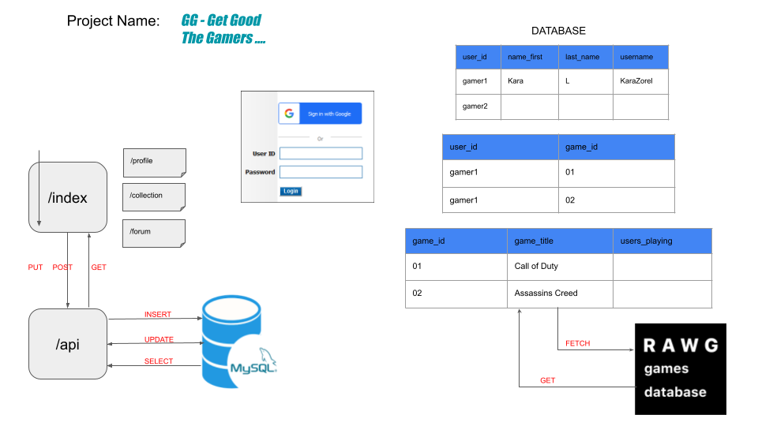
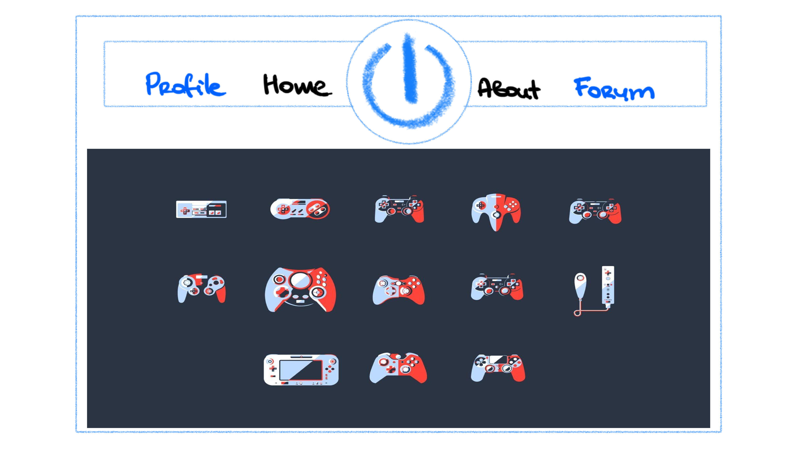
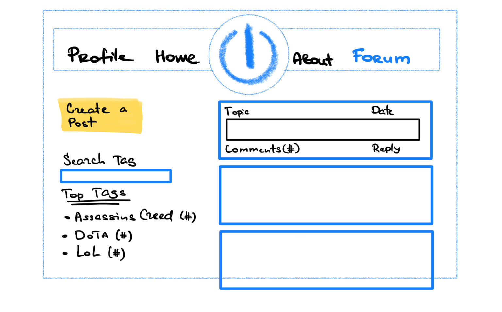
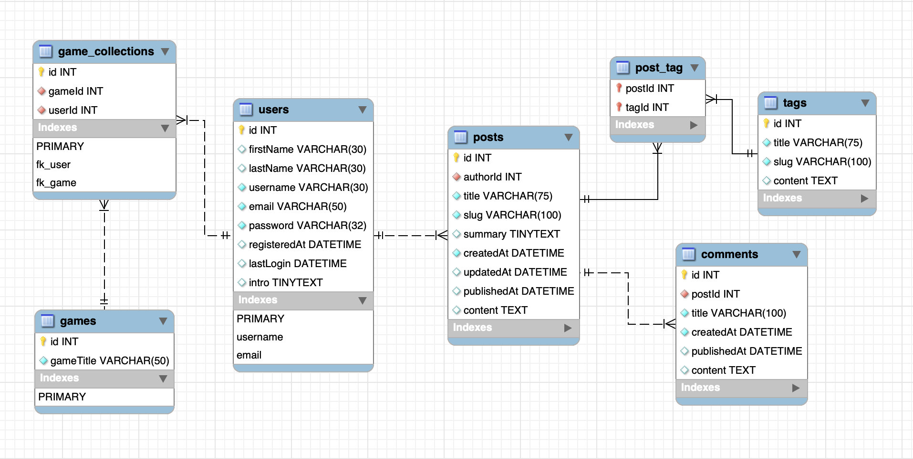

# Project-2

    Coding Bootcamp - Project - 2

  
Table of Contents

  <ol>
      <li>
      <a href="#about-the-project">About The Project</a>
      <ul>
        <li><a href="#live-url">Live URL</a></li>
        <li><a href="#team">Team</a></li>
      </ul>
    </li>
    <li><a href="#description">Description</a></li>
    <li><a href="#features">Features</a></li>
    <li><a href="#technical-part">Technical Part</a>
        <ul>
            <li><a href="#demo">Demo</a></li>
            <li><a href="#installation">Installation</a></li>
            <li><a href="#usage">Usage</a></li>
            <li><a href="#contributing">Contributing</a></li>
        </ul>
    </li>
    <li><a href="#questions">Questions</a></li>
    <li><a href="#license">License</a></li>
    <li><a href="#notes">Notes</a></li>

  </ol>

## About The Project

Good Gaming is all about finding your gaming buddy online. User can have a profile and can add games to their collection. Same game can be added into other user’s collection as well. Hence, they can find their Gaming Buddies. A game includes a title, description and a trailer. When games page is rendered, user is able to view all the games, their description and is able to play trailer as well. User is bale to register and login. User is able to view other people’s profile as well. Profile page of user includes User info, description of the user and games collection of the user.

#### **_Project WireFrame - our starting point_**

Project Webpage Ideas

Database EER diagrams

### Live URL

### Team

- [Joshua Mathew](https://github.com/Josco02)
- [Korolyova Lara](https://github.com/KorolyovaLara)
- [Sean McKay](https://github.com/seanmckay94)
- [Tinku Rani](https://github.com/tinkubansal95)

## Description

A web application where you can write, save and delete notes as much as you want.

## Features

- JavaScript
- Node.js
- npm

## Technical Part

### _Demo_

The screenshots below show this application previews:

### _Installation_

1. Download or clone repository
2. [**Node.js**](https://nodejs.org/en/about/) is required to run the application
3. Run `npm install` to install the required npm packages

### _Usage_

### _Contributing_

Pull requests are welcome. For major changes, please open an issue first to discuss what you would like to change, so I learn and understand it better.

Please make sure to update tests as appropriate, if applicable.

## Questions

## License

Licensed under the [MIT](https://github.com/KorolyovaLara/TeamProject-2/blob/main/LICENSE) license.

---

© 2021
